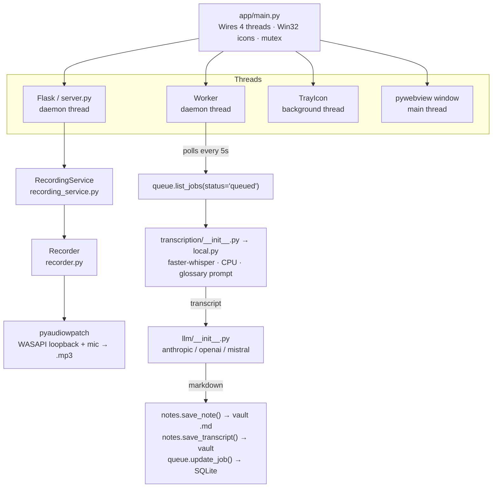
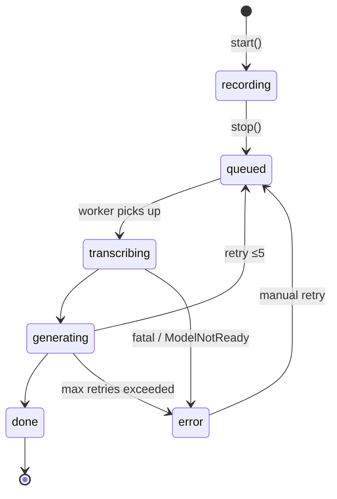
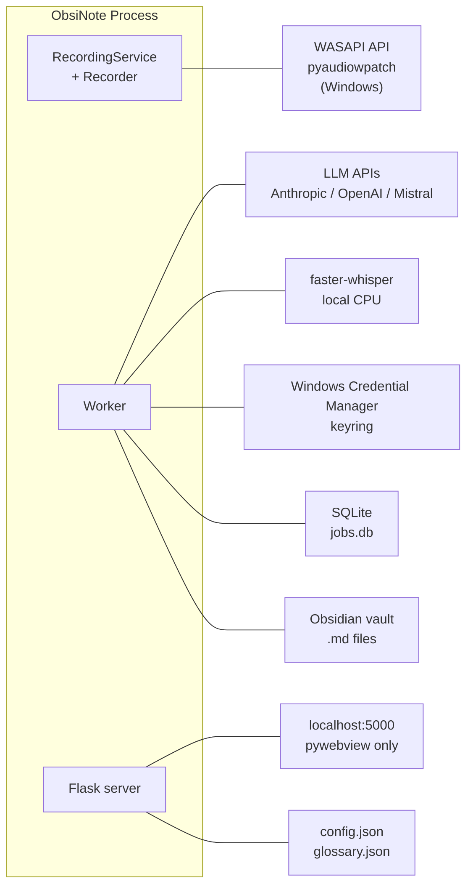
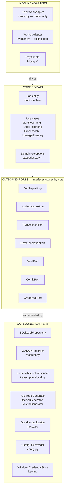

# ObsiNote — Architecture Analysis

**Date:** 2026-05-25 (updated after Refactor R1)  
**Scope:** Current as-built architecture (P8 + Refactor R1) + hexagonal architecture review

---

## 1. Current Architecture — As Built

### 1.1 Module Map

```
app/
├── main.py              Entrypoint — wires threads, Win32 icons, pywebview
├── server.py            Flask routes (delegates recording to RecordingService)
├── recording_service.py Recording lifecycle — start/stop, recorder state, tray notify
├── worker.py            Background processing loop
├── recorder.py          WASAPI dual-stream capture → mp3
├── queue.py             SQLite job queue + state machine
├── config.py            config.json load/save + constants
├── notes.py             Vault file writer + template loader
├── glossary.py          glossary.json reader/writer
├── tray.py              pystray tray icon
├── autostart.py         Windows registry autostart
├── i18n.py              Translations dict (en/cs)
├── version.py           VERSION constant
├── exceptions.py        LLMAuthError, LLMRateLimitError, ModelNotReadyError
├── utils.py             ffmpeg path helper
├── transcription/
│   ├── __init__.py      Provider dispatcher → transcribe()
│   └── local.py         faster-whisper adapter
└── llm/
    ├── __init__.py      Provider dispatcher → generate_notes(), suggest_glossary_terms()
    ├── anthropic_provider.py
    ├── openai_provider.py
    └── mistral_provider.py
```

### 1.2 Runtime Components and Data Flow



### 1.3 State Machine



### 1.4 External Boundaries



---

## 2. Hexagonal Architecture Review

Hexagonal architecture (Ports & Adapters) divides the system into three zones:

- **Core** — domain entities, business rules, use cases; no framework imports, no I/O
- **Ports** — interfaces owned by the core; define what the core needs, not how
- **Adapters** — concrete implementations that plug into ports (Flask, SQLite, WASAPI, Anthropic SDK…)

The goal is that the core can be tested and reasoned about in isolation, and any adapter can be swapped without touching the core.

### 2.1 What the Current Architecture Gets Right

**Provider dispatchers in `transcription/__init__.py` and `llm/__init__.py`** are the seeds of a ports pattern. They expose a single function (`transcribe`, `generate_notes`) and route to concrete implementations. The shape is correct; only the interface definition (ABC/Protocol) is missing.

**`exceptions.py` with domain exceptions** (`LLMAuthError`, `LLMRateLimitError`, `ModelNotReadyError`) is right. Domain exceptions belong in the core; they flow outward through ports.

**Recording decoupled from processing via the job queue** is a good architectural decision. The queue is the conceptual boundary between the capture side and the pipeline side, even if the code doesn't make that boundary explicit.

**`app/llm/` subpackage** with three interchangeable providers is the closest thing to a fully working adapter set. Swapping providers requires no changes to `worker.py` — that's the desired property.

### 2.2 Key Problems

#### ✅ Problem 1 — `server.py` was a god object — fixed in R1-1

`server.py` previously held three unrelated responsibilities:

| Responsibility | What it should be |
|---|---|
| HTTP adapter (Flask routes) | Primary adapter |
| Recording lifecycle (`start_recording`, `stop_recording`, `_recorder` global) | Application service / use case |
| File housekeeping (`cleanup_recordings`, `_recordings_size_mb`) | Infrastructure utility / outbound adapter |
| Tray communication (`_tray.set_recording()`) | Cross-cutting concern wired in `main.py` |

**R1-1 fix:** Recording lifecycle extracted to `app/recording_service.py`. `server.py` is now a thin HTTP adapter that delegates start/stop to `_recording_service`. File housekeeping (`cleanup_recordings`) remains in `server.py` — acceptable for a tool of this size.

#### Problem 2 — No application core layer (open)

There is no layer that says "here are the use cases of this application, defined independently of how they are triggered." The pipeline logic lives in `worker.py`, the recording logic now lives in `recording_service.py`, and config is read directly from disk in both. A hexagonal core would look like:

```
class ProcessJobUseCase:
    def __init__(self, transcriber: TranscriptionPort, note_generator: NoteGenerationPort,
                 vault: VaultPort, jobs: JobRepositoryPort): ...
    def execute(self, job_id: str) -> None: ...
```

Nothing like this exists. The closest equivalent, `worker._process_next()`, is entangled with queue polling, tray callbacks, config reads, and error bookkeeping.

#### Problem 3 — `queue.py` conflates infrastructure and domain (open)

`queue.py` owns both:

1. The **domain state machine** (the `STATES` list, the `recording → queued → transcribing → generating → done/error` transitions, startup recovery logic)
2. The **SQLite adapter** (SQL DDL, connection management, `sqlite3` calls)

In hexagonal terms, the state machine belongs in the core (`Job` entity, transition rules), and SQLite is one possible adapter implementing a `JobRepository` port. As it stands, you cannot unit-test the state machine without a real SQLite database.

#### ✅ Problem 4 — Config ambient in `Worker` — fixed in R1-3

`worker.py` previously called `cfg.load()` directly inside `_generate()` and `_maybe_delete_recording()`, making it impossible to test the worker's behaviour with a different config without patching the filesystem.

**R1-3 fix:** `Worker.__init__` now accepts an optional `config_loader` callable; defaults to `cfg.load`. `server.py` and `transcription/__init__.py` still call `cfg.load()` directly in route handlers and the transcription dispatcher — those are lower-priority since Flask routes are tested via the Flask test client.

#### ✅ Problem 5 — Ports lacked interface definitions — fixed in R1-2

`transcription/__init__.py` and `llm/__init__.py` acted as ports but defined no interface contract.

**R1-2 fix:** Both dispatchers now export named `Callable` type aliases:
- `TranscribeCallable = Callable[[str, str, Optional[str], str], str]`
- `GenerateNotesCallable = Callable[[str, str, str, str, str, str], str]`
- `SuggestTermsCallable = Callable[[str], List[Dict]]`

Contract conformance tests in `test_transcription.py` and `test_llm.py` verify all providers expose the expected function names and signatures.

#### ✅ Problem 6 — `worker._generate()` crossed multiple layers — partially fixed in R1-3

`worker._generate()` previously read config from disk (`cfg.load()`), validated business rules, called the LLM, saved files, and wrote back to SQLite — all in one method.

**R1-3 fix:** The config read is now injected. The remaining concerns (validate, call LLM, save, write SQLite) still live in the same method — separating them further would require the full use-case extraction from Problem 2, which is out of scope for this tool size.

### 2.3 What a Hexagonal Refactor Would Look Like

This is not a recommendation to refactor — the current code works well and is in a stable state. This is a map of where each piece would go if the architecture were restructured:



### 2.4 Pragmatic Takeaways — Implemented in Refactor R1 (2026-05-25)

All three targeted improvements have been applied. This was a between-phases refactor; P9 (Update Notifications) is the next production phase.

#### R1-1 — `RecordingService` extracted from `server.py` ✅

**New file:** `app/recording_service.py` — `RecordingService` class owns `_recorder`, `_current_job_id`, `_lock`, and `_tray`. `server.py` instantiates one service at module level and delegates start/stop calls to it; public wrapper functions (`start_recording`, `stop_recording`) preserved so `main.py` is unchanged. Route handlers read `_recording_service.is_recording` / `.current_job_id` instead of module globals.

**New tests:** `tests/test_recording_service.py` — 13 tests covering start/stop logic, tray notification, queue state, and the is_recording/current_job_id properties — all runnable without Flask.

#### R1-2 — Type-alias contracts for `transcription/` and `llm/` ✅

`app/transcription/__init__.py` exports `TranscribeCallable = Callable[[str, str, Optional[str], str], str]`.

`app/llm/__init__.py` exports `GenerateNotesCallable = Callable[[str, str, str, str, str, str], str]` and `SuggestTermsCallable = Callable[[str], List[Dict]]`. Both dispatcher functions are now type-annotated.

**New tests:** contract conformance tests in `tests/test_transcription.py` and `tests/test_llm.py` — verify aliases are importable, all three LLM providers expose the expected functions, and `transcribe_local` has the correct parameter names.

#### R1-3 — Config injection into `Worker` ✅

`Worker.__init__` accepts an optional `config_loader` callable; defaults to `cfg.load`. `_generate()` and `_maybe_delete_recording()` call `self._config_loader()` instead of `cfg.load()` directly.

**New tests:** `tests/test_worker.py` gains three injection tests — `test_worker_default_config_loader_uses_cfg_load`, `test_worker_injected_config_vault_path_empty_causes_retry`, `test_worker_injected_config_auto_delete_removes_file`. Existing tests remain unchanged because `Worker()` with no args inside the `patch("app.worker.cfg")` context still captures the mocked `cfg.load`.

**Test count after R1: 299 (was 261).**
